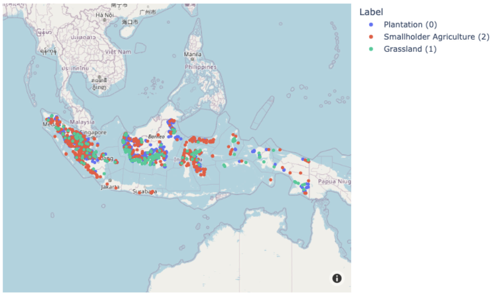

# Zero deforestation mission - NUWE - Schneider Electric

Code for the deforestation datathon. Group: Random For(r)est Gump





## Project Organization

    ├── README.md                   <- The top-level README for developers using this project.
    ├── src                
    │   ├── fast_nn.py              <- Script to train of the resnet NN with fast.ai
    │   ├── reoder_json.py          <- Reorders the predictions
    │   ├── keras_mixed_data_NN.py  <- Multi input keras neural net (image + tabular)
    │   ├── split_data.py           <- Deterministic split for local evaluation set
    │   ├── eda.py                  <- EDA script for tabular information
    │   └── Schneider.ipynb         <- Data exploration + tabular tests
    │
    ├── data                        <- Folder to put in data after downloading
    ├── app                         <- Huggingface online inference
    ├── main.ipynb                  <- Main script that results in final predictions for test set
    ├── predictions.csv
    ├── predictions.json            
    └── requirements.txt            <- PIP requirements to run codes

## Setup

Create virtual environment:
```bash
conda create -y --name deforestation python==3.9
conda activate deforestation
pip install -r requirements.txt
```

## Main file

The main file is `main.ipynb`. It contains the code for the model model training and ensemble. It can be run after installing the requirements and using the correct virtual environment, but it is slow since we are training a Neural network. For faster, training we recommend uploading the data and notebook to kaggle and running it from there, as we did during the hackathon.

It expects the data from the competition to be in the data folder, as provided by the organizers (a folder called train_test_data and two csv files, train.csv and test.csv).

## Huggingface app

The link to the huggingface app can be found in here: https://huggingface.co/spaces/davidmasip/Deforestation. 

You can see that the last commit is from Saturday 19th of November.

You can find some of the code of the app in `app/`. Not all code is included, as big files (the model.pkl) are not uploaded to github. You can find it in there anyway.


## Other files

We have some files in src of things that were tried in the hackathon, they contributed to the final solution but we prefered to have it all in one file.
